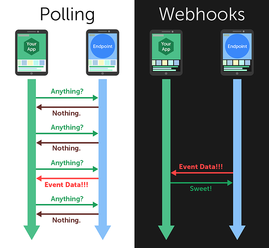

# Ставим Вебхуки


# Polling vs Webhook



## Polling
Поллинг - это стиль получения обновлений, с помощью запросов к сайту с длинной выдержкой

## Webhook
Блягодаря вебхуку, можно просто отправить Telegram ссылку куда присылать обновления, а мы создаём сервер и получаем их.


# Создаём сертификат

`mkdir ../ssl`

`openssl req -newkey rsa:2048 -sha256 -nodes -keyout ../ssl/private.key -x509 -days 365 -out ../ssl/public.pem -subj "/C=US/ST=New York/L=Brooklyn/O=Example Brooklyn Company/CN=YOURDOMAIN.EXAMPLE"`

Вместо `YOURDOMAIN.EXAMPLE` вставте ваш ip

# Пишем код

```py
# config.py
import ssl
...
USE_WEBHOOK = bool(g('USE_WEBHOOK') or False)
WEBHOOK_HOST = g('WEBHOOK_HOST')
WEBHOOK_PORT = int(g('WEBHOOK_PORT') or 8443)
WEBHOOK_PATH = g('WEBHOOK_PATH')
APP_PORT = int(g('APP_PORT') or WEBHOOK_PORT)
APP_HOST = g('APP_HOST', 'localhost')
SSL_CERT = g('SSL_CERT')
SSL_KEY = g('SSL_KEY')

WEBHOOK_URL = f'https://{WEBHOOK_HOST}:{WEBHOOK_PORT}{WEBHOOK_PATH}'
WEBHOOK_SERVER = {
    'host': APP_HOST,
    'port': APP_PORT,
    'webhook_path': WEBHOOK_PATH,
}
if SSL_CERT and SSL_KEY:
    context = ssl.SSLContext(ssl.PROTOCOL_TLSv1_2)
    context.load_cert_chain(SSL_CERT, SSL_KEY)
    WEBHOOK_SERVER['ssl_context'] = context
```

```py
# bot/__main__.py
...
from config import (
    USE_WEBHOOK,
    WEBHOOK_SERVER, 
    WEBHOOK_URL, 
    SSL_CERT
)


async def rm_webhook(dp: Dispatcher):
    await dp.bot.delete_webhook()


async def set_webhook(dp: Dispatcher):
    cert = open(SSL_CERT, 'rb') if SSL_CERT else None
    await dp.bot.set_webhook(WEBHOOK_URL, certificate=cert)


executor.on_startup(set_webhook, polling=False)
executor.on_startup(rm_webhook, webhook=False)
executor.on_shutdown(rm_webhook, polling=False)

if USE_WEBHOOK:
    executor.start_webhook(**WEBHOOK_SERVER)
else:
    executor.start_polling()
```


# Config SelfSign Cert on IP

Настройки для запуска вебхука

Плюсы:
- Не требуются дополнительные зависимости

Минусы:
- Можно запустить только 4 бота
- Отбирает свободный порт
- Для портов 80, 443 требуются права рута

```py
# .env
...
WEBHOOK_HOST=<IP>
WEBHOOK_PORT=8443
WEBHOOK_PATH=/
APP_HOST=<LOCAL_IP>
SSL_CERT=../ssl/public.pem
SSL_KEY=../ssl/private.key
```

# Config SelfSign Cert on IP with Nginx(Best)

Плюсы:
- Возможен запуск большого количества ботов
- Не отбирает порт

```
# .env
...
WEBHOOK_HOST=<IP>
WEBHOOK_PORT=8443
WEBHOOK_PATH=/tgwh/token
APP_HOST=localhost
APP_PORT=8600[-8750]
SSL_CERT=../ssl/public.pem
```

```nginx
# nginx config

server {
    listen 8443 ssl;

    ssl_certificate     /path/to/ssl/public.pem;
    ssl_certificate_key /path/to/ssl/private.key;

    location /tgwh/token {
        proxy_pass http://localhost:8600;
    }
}
```

# Public cert and domain with nginx

Плюсы: 
- Относительно прост в настройке
- Возможен запуск рядом с сайтом

Минусы:
- Требуются зависимости
  - Домен
  - Сертификат

```
# .env
...
WEBHOOK_HOST=<DOMAIN>
WEBHOOK_PORT=443
WEBHOOK_PATH=/tgwh/token
APP_HOST=localhost
APP_PORT=8600[-8750]
```

```nginx
server {
    listen 443 ssl;

    location /tgwh/token {
        proxy_pass http://localhost:8600;
    }

    # cert configs
    # ...
}
```

# Links

О создании самописного сертификата: https://core.telegram.org/bots/self-signed

Подробней о вебхуках: https://core.telegram.org/bots/webhooks

Бесплатные домены: https://www.freenom.com/

Бесплатный сертификат: https://certbot.eff.org/

